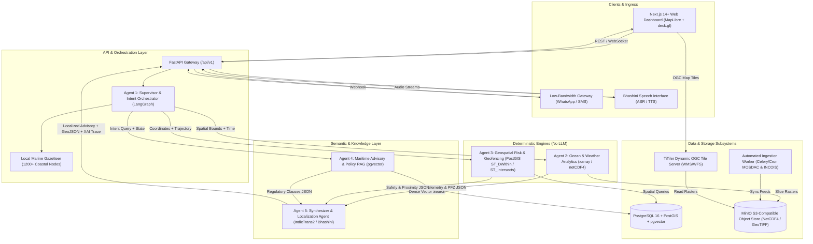
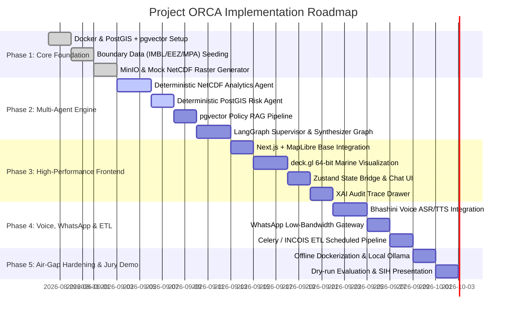

# PROJECT ORCA (SIH26176) — Master Architecture, Integration & Execution Blueprint

> **Ocean Resource & Coastal Advisory (ORCA)**  
> *A Sovereign, Air-Gappable, Multi-Agent Maritime Decision Support & Advisory System for Indian Coastal Fisheries, Marine Safety, and Boundary Geofencing.*

---

## 1. Executive Summary & Vision

**Project ORCA** is designed for the **Smart India Hackathon (SIH 2026)** to address the critical needs of the Indian maritime ecosystem (ISRO, INCOIS, Indian Coast Guard, and Ministry of Fisheries). 

### The Core Problem
1. **Marine Safety & International Boundary Incursions:** Fishermen inadvertently cross the International Maritime Boundary Line (IMBL) into Sri Lankan or Pakistani waters or stray into dangerous weather/cyclone sectors.
2. **Economic Inefficiency:** Locating Potential Fishing Zones (PFZs) relies on fragmented, high-latency data that is inaccessible to vernacular and low-bandwidth users.
3. **Black-Box AI Distrust:** Government authorities and scientists require deterministic, mathematically verifiable safety decisions rather than hallucinated LLM responses.

### The ORCA Architectural Principle
> **"Deterministic code for mathematical & spatial truth; LLMs strictly for semantic reasoning and natural language synthesis."**

```
┌────────────────────────────────────────────────────────────────────────────────────────┐
│                                   PROJECT ORCA SYSTEM                                 │
├─────────────────────────────────────────┬──────────────────────────────────────────────┤
│ Deterministic Computational Core        │ Semantic & Cognitive Layer                   │
├─────────────────────────────────────────┼──────────────────────────────────────────────┤
│ • PostGIS Spatial SQL (IMBL, EEZ, MPAs) │ • LangGraph Multi-Agent Orchestration        │
│ • NetCDF4 / xarray (SST, Chlorophyll)   │ • pgvector Regulatory RAG Search             │
│ • TiTiler Dynamic OGC WMS/WFS Tiles     │ • Bhashini Indic Multilingual Speech Pipeline│
│ • Sub-second, zero-hallucination math   │ • Explainable AI (XAI) Audit Traceability    │
└─────────────────────────────────────────┴──────────────────────────────────────────────┘
```

---

## 2. End-to-End System Architecture



---

## 3. Five-Agent Multi-Agent Workflow Specification

```
                          ┌─────────────────────────────┐
                          │   Incoming User Request     │
                          │   "Can 4 boats go 30km SW   │
                          │    of Veraval for Tuna?"    │
                          └──────────────┬──────────────┘
                                         │
                                         ▼
                          ┌─────────────────────────────┐
                          │  Agent 1: Supervisor (LLM)  │
                          │  - Extracts Entities        │
                          │  - Resolves via Gazetteer   │
                          │  - Dispatches StateGraph    │
                          └──────────────┬──────────────┘
                                         │
              ┌──────────────────────────┼──────────────────────────┐
              ▼                          ▼                          ▼
   ┌───────────────────────┐ ┌───────────────────────┐ ┌────────────────────────┐
   │  Agent 2: Analytics   │ │ Agent 3: Risk & Geo   │ │  Agent 4: Policy RAG   │
   │  [Deterministic]      │ │ [Deterministic]       │ │  [pgvector + Embeddings│
   │  - Open NetCDF/xarray │ │ - PostGIS SQL Checks  │ │  - Retrieve Circulars  │
   │  - SST & Chlorophyll  │ │ - IMBL Proximity (km) │ │  - Monsoon Trawl Bans  │
   │  - PFZ Intersections  │ │ - Marine Sanctuary    │ │  - Species Regulations │
   │  - Wind & Wave Heights│ │ - Cyclone Buffer Zone │ │  - Catch Size Limits   │
   └──────────┬────────────┘ └───────────┬───────────┘ └───────────┬────────────┘
              │                          │                         │
              └──────────────────────────┼─────────────────────────┘
                                         │
                                         ▼
                          ┌─────────────────────────────┐
                          │ Agent 5: Synthesizer (LLM)  │
                          │ - Reconciles Telemetry      │
                          │ - Formulates XAI Audit Log  │
                          │ - Translates via Bhashini   │
                          │ - Emits GeoJSON + Text/Voice│
                          └──────────────┬──────────────┘
                                         │
                                         ▼
                          ┌─────────────────────────────┐
                          │ UI Payload + GeoJSON Layers │
                          │ + Audio + WhatsApp Payload  │
                          └─────────────────────────────┘
```

### Agent Detailed Specifications

| Agent | Processing Type | Core Tech / Libraries | Input | Deterministic Output / Role |
|---|---|---|---|---|
| **1. Supervisor** | LLM / Structured Output | LangGraph, Pydantic, Local Gazetteer | Raw text or voice transcript | `{ origin: [lat, lon], target_bbox: [...], time_window, species: "Tuna" }` |
| **2. Ocean Analytics** | **Deterministic** | `xarray`, `rasterio`, `netCDF4`, `scipy` | Bounding box, timestamp, MinIO raster path | `{ pfz_detected: true, sst: 28.4°C, wave_height: 1.4m, wind_knots: 14.2 }` |
| **3. Geospatial Risk** | **Deterministic** | PostgreSQL 16, PostGIS 3.4 (`ST_DWithin`, `ST_Distance`) | Target coordinates, route trajectory | `{ is_safe: true, imbl_dist_km: 42.6, mpa_violation: false, hazards: [] }` |
| **4. Policy RAG** | Vector Search + LLM | `pgvector`, `bge-small-en-v1.5`, State Circulars Corpus | Sector query, season, vessel class | `{ active_bans: "None in Gujarat sector", regulations: "Mesh >= 40mm", citation: "DOC-2026-04" }` |
| **5. Synthesizer** | Multilingual LLM | IndicTrans2 / Bhashini API / Mistral/Llama-3 | Aggregate JSON from Agents 2, 3, 4 | Localized advisory (Gujarati/Tamil/Hindi/etc.), GeoJSON vectors, and XAI trace |

---

## 4. Database Schema & Storage Design

### 4.1 PostgreSQL + PostGIS + pgvector Schema

```sql
-- Enable Extensions
CREATE EXTENSION IF NOT EXISTS postgis;
CREATE EXTENSION IF NOT EXISTS vector;

-- 1. Coastal Landing Nodes & Gazetteer
CREATE TABLE coastal_nodes (
    id SERIAL PRIMARY KEY,
    name VARCHAR(100) NOT NULL,
    vernacular_names JSONB DEFAULT '{}', -- e.g. {"gu": "વેરાવળ", "hi": "वेरावल", "ta": "வேராவல்"}
    state VARCHAR(50) NOT NULL,
    location GEOMETRY(Point, 4326) NOT NULL
);
CREATE INDEX idx_coastal_nodes_geom ON coastal_nodes USING GIST(location);

-- 2. Maritime Boundaries (IMBL, EEZ, Contiguous Zones)
CREATE TABLE maritime_boundaries (
    id SERIAL PRIMARY KEY,
    boundary_type VARCHAR(50) NOT NULL, -- 'IMBL', 'EEZ', 'TERRITORIAL'
    country_a VARCHAR(50) NOT NULL,
    country_b VARCHAR(50),
    geom GEOMETRY(MultiLineString, 4326) NOT NULL
);
CREATE INDEX idx_maritime_boundaries_geom ON maritime_boundaries USING GIST(geom);

-- 3. Marine Protected Areas & Wildlife Sanctuaries
CREATE TABLE marine_protected_areas (
    id SERIAL PRIMARY KEY,
    name VARCHAR(150) NOT NULL,
    designation VARCHAR(100), -- 'National Park', 'Biosphere Reserve', 'No-Fishing Zone'
    rules JSONB,
    geom GEOMETRY(MultiPolygon, 4326) NOT NULL
);
CREATE INDEX idx_mpa_geom ON marine_protected_areas USING GIST(geom);

-- 4. Dynamic Hazard Buffers (Cyclones, High Waves)
CREATE TABLE active_hazard_zones (
    id SERIAL PRIMARY KEY,
    hazard_type VARCHAR(50) NOT NULL, -- 'CYCLONE_WARNING', 'SWELL_SURGE', 'HIGH_WAVE'
    severity VARCHAR(20) NOT NULL,    -- 'WARNING', 'ALERT', 'WATCH'
    valid_until TIMESTAMP WITH TIME ZONE NOT NULL,
    geom GEOMETRY(Polygon, 4326) NOT NULL
);
CREATE INDEX idx_hazard_geom ON active_hazard_zones USING GIST(geom);

-- 5. Maritime Regulatory & Advisory Corpus (pgvector RAG)
CREATE TABLE maritime_regulations (
    id SERIAL PRIMARY KEY,
    source_title VARCHAR(255) NOT NULL,
    authority VARCHAR(100) NOT NULL,   -- 'Dept of Fisheries', 'Indian Coast Guard', 'INCOIS'
    state VARCHAR(50),
    category VARCHAR(50),              -- 'MONSOON_BAN', 'GEAR_SPECS', 'SAFETY_MANDATE'
    content TEXT NOT NULL,
    effective_start DATE,
    effective_end DATE,
    embedding VECTOR(384)              -- Compatible with bge-small-en-v1.5
);
CREATE INDEX idx_regulations_embedding ON maritime_regulations USING hnsw (embedding vector_cosine_ops);

-- 6. Audit & XAI Logs
CREATE TABLE query_audit_logs (
    id UUID PRIMARY KEY DEFAULT gen_random_uuid(),
    created_at TIMESTAMP WITH TIME ZONE DEFAULT NOW(),
    raw_query TEXT NOT NULL,
    resolved_bbox JSONB NOT NULL,
    agent_telemetry_payload JSONB NOT NULL,
    agent_spatial_risk_payload JSONB NOT NULL,
    agent_rag_payload JSONB NOT NULL,
    synthesized_response TEXT NOT NULL,
    language_code VARCHAR(10) NOT NULL,
    execution_time_ms INTEGER NOT NULL
);
```

### 4.2 MinIO Object Storage Structure
```
minio-bucket: /orca-ocean-data/
├── sst/
│   ├── 20260827_insat3d_sst_india.nc
│   └── 20260828_insat3d_sst_india.nc
├── chlorophyll/
│   └── 20260827_oceansat3_ocm_chla.nc
├── currents/
│   └── 20260827_incois_surface_currents.nc
├── wave_height/
│   └── 20260827_incois_swh_forecast.nc
└── cog/ (Cloud-Optimized GeoTIFFs for TiTiler streaming)
    ├── sst_20260827.tif
    └── chla_20260827.tif
```

---

## 5. Technology Stack & Component Mapping

| Subsystem | Technology | Purpose & Justification |
|---|---|---|
| **Frontend Base** | **Next.js 14+ (React 19, TypeScript)** | High-speed SSR, App Router, responsive layout. |
| **Map Base** | **MapLibre GL JS** | Open-source, WebGL GPU-accelerated 60 FPS vector map. |
| **Marine Layer Overlays** | **deck.gl (Interleaved Mode)** | 64-bit high-precision GPU layers for SST heatmaps, ocean current vector arrows, and PFZ bounding hulls. |
| **Frontend State Sync** | **Zustand** | Zero-boilerplate, high-performance bridge between chat streams and map viewport flying. |
| **UI Components** | **Tailwind CSS + Shadcn/ui + Lucide** | Clean, accessible, sovereign government design system (Dark/Light mode, XAI Audit Drawer). |
| **Backend Gateway** | **FastAPI (Python 3.11+)** | Asynchronous, high-throughput REST and WebSocket gateway. |
| **Agent Orchestration** | **LangGraph + Pydantic v2** | Cyclic/parallel state machine graphs with deterministic fallback routing. |
| **Numerical Processing** | **xarray, rasterio, numpy, scipy** | High-performance multi-dimensional array extraction from NetCDF/HDF5 files. |
| **Dynamic Tile Server** | **TiTiler (FastAPI)** | Converts NetCDF/COG rasters on MinIO to OGC WMS/WFS tiles on the fly. |
| **Spatial + Vector DB** | **PostgreSQL 16 + PostGIS + pgvector** | Unified sovereign OGC-compliant spatial database and local embedding search. |
| **Object Storage** | **MinIO** | S3-compatible, air-gapped local storage for scientific ocean data. |
| **Indic Voice / NLP** | **Bhashini API / IndicTrans2** | Real-time speech-to-text (ASR) and text-to-speech (TTS) for 22 Indian regional languages. |
| **Low-Bandwidth Fallback**| **WhatsApp Cloud API / SMS Webhook**| Deep-sea text gateway for SMS/WhatsApp queries when off 5G grid. |
| **Local LLM Engine** | **Ollama / vLLM (Mistral 7B / Llama 3 8B / Qwen)** | Air-gapped, zero-cloud LLM inference for sovereign local deployment. |
| **Deployment** | **Docker Compose** | One-command, fully offline, air-gapped build. |

---

## 6. Directory & Codebase Structure

```
ORCA/
├── docker-compose.yml              # Complete sovereign local stack
├── README.md
├── Makefile                        # Dev commands: make up, make seed, make dev
│
├── backend/                        # FastAPI Backend Application
│   ├── Dockerfile
│   ├── requirements.txt
│   ├── main.py                     # App entrypoint & CORS / routing
│   │
│   ├── app/
│   │   ├── api/
│   │   │   ├── v1/
│   │   │   │   ├── query.py        # /api/v1/query (Full agent execution)
│   │   │   │   ├── telemetry.py    # /api/v1/telemetry (Point & bbox lookup)
│   │   │   │   ├── geofence.py     # /api/v1/geofence (IMBL/MPA checks)
│   │   │   │   ├── voice.py        # /api/v1/voice (Bhashini audio upload/streaming)
│   │   │   │   └── whatsapp.py     # /api/v1/whatsapp (Webhook handler)
│   │   │   └── deps.py
│   │   │
│   │   ├── agents/                 # LangGraph Multi-Agent Workflows
│   │   │   ├── state.py            # AgentState TypedDict / Pydantic models
│   │   │   ├── graph.py            # LangGraph StateGraph builder & compiler
│   │   │   ├── supervisor.py       # Agent 1: Query decomposition & Gazetter tool
│   │   │   ├── ocean_analytics.py  # Agent 2: xarray NetCDF processing & PFZ math
│   │   │   ├── spatial_risk.py     # Agent 3: PostGIS boundary & proximity validator
│   │   │   ├── policy_rag.py       # Agent 4: pgvector regulatory retriever & reader
│   │   │   └── synthesizer.py      # Agent 5: Multilingual aggregator & GeoJSON builder
│   │   │
│   │   ├── core/
│   │   │   ├── config.py           # Environment settings (DB, MinIO, Ollama)
│   │   │   ├── db.py               # Async SQLAlchemy / asyncpg engine
│   │   │   └── minio_client.py     # S3 MinIO storage wrapper
│   │   │
│   │   ├── services/
│   │   │   ├── bhashini.py         # Indic ASR / TTS / NMT integration
│   │   │   ├── gazetteer.py        # 1200+ Indian landing center lookup
│   │   │   ├── titiler_service.py  # Dynamic tile URL generator
│   │   │   └── etl_worker.py       # Scheduled NetCDF download & raster sync
│   │   │
│   │   └── models/
│   │       ├── db_models.py        # SQLAlchemy models (PostGIS + pgvector)
│   │       └── schemas.py          # Pydantic schemas for APIs and agents
│   │
│   └── data/
│       ├── seed_boundaries.geojson # IMBL, EEZ, MPAs seed data
│       ├── seed_gazetteer.json     # Coastal landing sites coordinates
│       └── seed_regulations.json   # Monsoon bans, fisheries circulars
│
├── frontend/                       # Next.js 14+ Dashboard
│   ├── Dockerfile
│   ├── package.json
│   ├── tsconfig.json
│   ├── tailwind.config.ts
│   ├── app/
│   │   ├── layout.tsx              # Root layout with theme provider
│   │   ├── page.tsx                # Main Split-Pane Dashboard
│   │   └── globals.css             # Base styles & MapLibre fixes
│   │
│   ├── components/
│   │   ├── map/
│   │   │   ├── MapContainer.tsx    # MapLibre GL JS wrapper
│   │   │   ├── DeckGlOverlay.tsx   # deck.gl layers (SST heatmap, current vectors, PFZ)
│   │   │   ├── LayerControl.tsx    # Toggle SST, Currents, Waves, IMBL, MPAs
│   │   │   └── CoordinateBar.tsx   # Live cursor coordinates & depth/SST readout
│   │   │
│   │   ├── chat/
│   │   │   ├── ChatPanel.tsx       # Multi-agent chat interface
│   │   │   ├── MessageItem.tsx     # Rich message bubbles with action chips
│   │   │   ├── VoiceInput.tsx      # Audio recording & Bhashini STT button
│   │   │   └── LanguageSelector.tsx# Regional language switcher (Hindi, Gujarati, Tamil, etc.)
│   │   │
│   │   ├── audit/
│   │   │   ├── XaiAuditDrawer.tsx  # Slide-out XAI inspection panel
│   │   │   ├── SqlTraceView.tsx    # Exact PostGIS queries executed
│   │   │   ├── TelemetryCard.tsx   # Numerical breakdown (SST, Wave, Wind)
│   │   │   └── CitationList.tsx    # Regulatory document citations
│   │   │
│   │   └── ui/                     # Shadcn accessible UI components
│   │       ├── button.tsx
│   │       ├── dialog.tsx
│   │       ├── card.tsx
│   │       └── badge.tsx
│   │
│   ├── hooks/
│   │   ├── useOrcaChat.ts          # Zustand + WebSocket chat hook
│   │   ├── useVoiceRecorder.ts     # MediaRecorder audio capture
│   │   └── useMapViewport.ts       # FlyTo & Bounding Box sync hook
│   │
│   └── store/
│       └── useOrcaStore.ts         # Global Zustand state (Map, Layers, Agents, Audit)
│
└── docs/                           # Documentation & Jury Artifacts
    ├── agent.md
    ├── api.md
    ├── backend.md
    ├── frontend.md
    ├── misc.md
    └── reference.md
```

---

## 7. Step-by-Step Implementation Roadmap



### Detailed Phase Milestones

#### **Phase 1: Foundation & Spatial/Object Storage Core**
1. **Container Infrastructure:** Configure `docker-compose.yml` containing PostgreSQL 16 (with PostGIS + pgvector), MinIO, TiTiler, and Ollama.
2. **Geospatial Boundaries Seed:** Load GeoJSON/Shapefiles for:
   - India–Sri Lanka IMBL (Palk Strait & Gulf of Mannar)
   - India–Pakistan IMBL (Sir Creek & Gujarat sector)
   - Indian 200 NM Exclusive Economic Zone (EEZ)
   - MPAs (Gulf of Mannar Marine National Park, Sundarbans, Gahirmatha Marine Sanctuary)
3. **Gazetteer Ingestion:** Populate 1,223 coastal nodes with regional multilingual names.
4. **NetCDF Data Staging:** Generate/download representative sample NetCDF grids for SST, Chlorophyll-a, Significant Wave Height, and Wind vectors into MinIO.

#### **Phase 2: LangGraph Multi-Agent Backend**
1. **Agent 1 (Supervisor):** Build Pydantic schemas enforcing output `{ origin, target_bbox, time_window, species }`. Connect local Gazetteer fuzzy matcher.
2. **Agent 2 (Ocean Analytics):** Implement `xarray` dataset reader. Implement PFZ thermal edge gradient algorithm ($\nabla SST \ge 0.5^\circ\text{C/km}$ intersecting $\text{Chl-}a \ge 0.3\,\text{mg/m}^3$).
3. **Agent 3 (Geospatial Risk):** Write parameterized PostGIS SQL queries returning exact distances in kilometers to IMBL and MPA boundaries with binary safety classifications.
4. **Agent 4 (Policy RAG):** Vectorize Indian fisheries regulations and monsoon ban circulars using `bge-small-en-v1.5` and store in `pgvector`.
5. **Agent 5 (Synthesizer):** Assemble deterministic outputs into structured JSON, generate natural language explanations, and output GeoJSON layers for the client map.
6. **StateGraph Compilation:** Link all 5 agents in LangGraph with parallel execution of Agents 2, 3, and 4.

#### **Phase 3: High-Performance Frontend & UI**
1. **MapLibre Engine:** Configure MapLibre GL JS with custom dark ocean vector tiles and bathymetry shading.
2. **deck.gl Marine Overlays:**
   - `HeatmapLayer` / `TileLayer` for Sea Surface Temperature.
   - `VectorFieldLayer` / `LineLayer` for Ocean Current direction and velocity arrows.
   - `PolygonLayer` / `GeoJsonLayer` for PFZ bounding hulls, IMBL alert zones, and MPAs.
   - `PathLayer` for proposed safe vessel navigation routes.
3. **Zustand Store:** Connect chat responses directly to the map instance. Trigger `map.flyTo()` upon PFZ or coordinate detection.
4. **XAI Audit Drawer:** Build an interactive inspector displaying:
   - Executed PostGIS SQL snippet and bounding polygon.
   - NetCDF numerical telemetry values.
   - Regulatory document clause citations.

#### **Phase 4: Low-Bandwidth Channels, Speech & ETL**
1. **Bhashini Speech Pipeline:** Integrate Bhashini ULCA API for speech-to-text (user speaks in Gujarati/Tamil) and text-to-speech (audio playback).
2. **WhatsApp Gateway:** Implement webhook endpoint for Twilio / Meta WhatsApp API handling formatted text messages for offshore fishermen.
3. **Automated ETL Pipeline:** Create Celery/cron task fetching live forecasts from INCOIS ERDDAP / MOSDAC servers and archiving to MinIO.

#### **Phase 5: Air-Gapped Verification & Demo Packaging**
1. **Local LLM Quantization:** Package local Ollama models (`llama3:8b-instruct-q4_K_M` or `mistral:7b-instruct`) inside the Docker environment.
2. **Air-Gap Validation:** Disconnect host Wi-Fi/Internet, run `docker-compose up`, and verify complete query execution, PostGIS validation, raster slicing, and UI rendering offline.
3. **Jury Scenarios Scripting:** Prepare 4 live test cases:
   - *Scenario A (Safe PFZ):* Veraval Tuna fishing inquiry $\rightarrow$ detects PFZ 30 km SW, safe from IMBL.
   - *Scenario B (Border Alert):* Rameshwaram query near Sri Lankan IMBL $\rightarrow$ triggers critical red IMBL proximity alarm.
   - *Scenario C (Monsoon Ban):* Trawling inquiry during active state seasonal ban $\rightarrow$ triggers legal regulatory alert citing circular.
   - *Scenario D (Voice in Tamil):* Voice note query $\rightarrow$ synthesized audio response in Tamil.

---

## 8. SIH 2026 Evaluation Alignment & Winning Strategy

```
┌───────────────────────────────────────────────────────────────────────────────────────┐
│                                SIH 2026 JURY RUBRIC                                   │
├──────────────────────────┬────────────────────────────────────────────────────────────┤
│ Criteria                 │ How Project ORCA Scores Maximum Points                     │
├──────────────────────────┼────────────────────────────────────────────────────────────┤
│ 1. Technical Innovation  │ • Hybrid Deterministic-LLM Architecture (no hallucinations)│
│                          │ • 64-bit GPU Deck.gl marine data visualization             │
│                          │ • OGC compliant TiTiler dynamic tile generation            │
├──────────────────────────┼────────────────────────────────────────────────────────────┤
│ 2. Real-World Feasibility│ • WhatsApp / SMS gateway for low-bandwidth deep-sea boats  │
│                          │ • Bhashini multi-language speech for illiterate fishermen  │
│                          │ • Integration with official MOSDAC & INCOIS data sources   │
├──────────────────────────┼────────────────────────────────────────────────────────────┤
│ 3. Security & Sovereignty│ • 100% on-premise, air-gapped deployment (zero cloud lock) │
│                          │ • PostgreSQL + PostGIS + pgvector (NSDI standard)          │
│                          │ • Verifiable XAI audit logs for Coast Guard / Scientists   │
├──────────────────────────┼────────────────────────────────────────────────────────────┤
│ 4. Execution & Polish    │ • 60 FPS GPU-accelerated split-screen dashboard            │
│                          │ • One-click Docker Compose deploy                          │
│                          │ • Verified scientific PFZ detection algorithms             │
└──────────────────────────┴────────────────────────────────────────────────────────────┘
```

---

## 9. Next Immediate Action Plan

To start coding this system immediately:
1. **Initialize the repository structure** (`/backend`, `/frontend`, `/docs`, `docker-compose.yml`).
2. **Set up the Docker Compose stack** (PostGIS, MinIO, TiTiler, Backend, Frontend).
3. **Implement Phase 1 & 2 Backend core** (AgentState, deterministic PostGIS risk tool, xarray NetCDF reader).
4. **Implement Phase 3 Next.js Dashboard** with MapLibre + deck.gl visualization.

*(This master plan is saved in [INTEGRATION_PLAN.md](file:///Users/cookiecoderr/SIH-26176/ORCA/INTEGRATION_PLAN.md)).*
