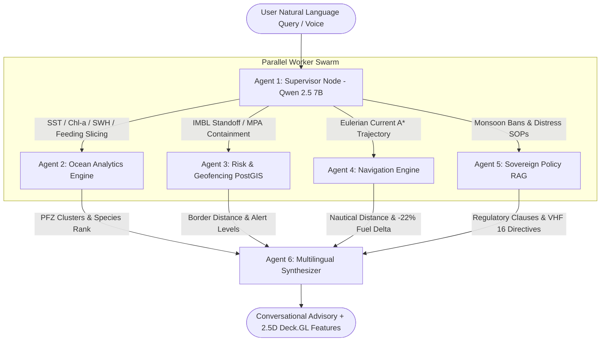

# 🐬 Project ORCA — Sovereign Multi-Agent Marine Intelligence Command Platform

[](https://www.sih.gov.in/)
[](http://localhost:8000/docs)
[](http://localhost:3000)
[](https://langchain.com/)
[](https://postgis.net/)
[](https://deck.gl/)

> **Project ORCA (Oceanic Reasoning & Conversational Agent)** is India's sovereign, air-gappable Marine Intelligence & Conversational Decision-Support Platform built for **Smart India Hackathon (SIH-26176)**.
> 
> ORCA integrates satellite Earth Observation (EO) products (ISRO MOSDAC, Copernicus, Sentinel-3, INCOIS), hydrodynamic ocean physics, PostGIS sovereign geofencing, and statutory fisheries gazettes into an explainable conversational decision-support system tailored for fishermen, marine researchers, port authorities, and coast guard defense operators.

---

## 🏛️ Portal Information Architecture (4 Core Views)

```
ORCA Sovereign Portal
├── 🧭 1. Tactical Command (2.5D Deck.GL Radar Map, Target HUD, Thought Stream, Action Card, Telemetry Strip)
├── 🕸️ 2. Agent Swarm Mesh (3Blue1Brown Synaptic Neural Flow & Modular Execution DAG with Latency Waterfall)
├── 🛰️ 3. Ocean Earth Observation (EO) Data Hub (7-Layer Provenance Catalog, 72h Temporal Scrubber)
└── ⚖️ 4. Fleet Safety & Regulatory Vault (61-Day Monsoon Ban Matrix, pgvector Policy RAG, MRCC Hotline Directory)
```

---

## 🚀 Quick Start Guide

### 📋 Prerequisites
- **Node.js**: v18.17.0+ or v20+
- **Python**: 3.11+
- **Git**
- *(Optional for live AIS vessel tracking)*: Free API Key from [aisstream.io](https://aisstream.io)

---

### 1️⃣ Clone & Setup Repository
```bash
git clone https://github.com/Cookie-CoDeRR/ORCA.git
cd ORCA
```

---

### 2️⃣ Run Frontend (Next.js 16 + Deck.GL)
```bash
cd orca-frontend

# Install dependencies
npm install

# Start development server
npm run dev
```
👉 Open **[http://localhost:3000/dashboard](http://localhost:3000/dashboard)** in your browser.

---

### 3️⃣ Run Backend (FastAPI + LangGraph Swarm)

#### Option A: Local Python Virtual Environment (Recommended)
```bash
cd orca-backend

# Activate the pre-configured virtualenv
source .venv/bin/activate

# (If creating fresh venv):
# python3 -m venv .venv && source .venv/bin/activate && pip install -r requirements.txt

# Start FastAPI Uvicorn dev server on Port 8000
uvicorn src.main:app --host 0.0.0.0 --port 8000 --reload
```
👉 Open **Interactive Swagger API Docs**: **[http://localhost:8000/docs](http://localhost:8000/docs)**

#### Option B: Full Stack with Docker Compose (PostGIS + pgvector + MinIO + FastAPI)
```bash
cd orca-backend
docker compose up -d
```

---

## 🔑 Environment Configuration (`orca-frontend/.env.local`)

```env
# Backend API Base URL
NEXT_PUBLIC_API_BASE=http://localhost:8000

# Basemap Carto CDN Key
NEXT_PUBLIC_CARTO_API_KEY=cb1_2dhp_1_9403bbcac732699b29121f7e

# Real-Time AIS Ship Transponders (Free from https://aisstream.io)
# If left empty, ORCA automatically runs deterministic Indian Ocean route simulation
NEXT_PUBLIC_AIS_API_KEY=
```

---

## 🧠 Multi-Agent Swarm Architecture



| # | Agent Name | Technology Core | Primary Responsibility |
|---|---|---|---|
| **1** | **Supervisor Orchestrator** | `Qwen 2.5 7B-Instruct` | Zero-shot intent decomposition, Indian coastal gazetteer geocoding, and Pydantic task graph dispatch. |
| **2** | **Ocean Analytics Engine** | `xarray` + `NetCDF4` / Open-Meteo | Sub-second multidimensional slicing over SST, Chlorophyll-a, Significant Wave Height, and diurnal feeding cycles. |
| **3** | **Risk & Geofencing Engine** | PostgreSQL 16 / PostGIS (`ST_Distance`) | Sub-meter geodesic distance calculation to India-Pakistan & India-Sri Lanka IMBL and Marine Protected Areas (MPAs). |
| **4** | **Vector Navigation Engine** | Continuous A* ($u_o, v_o, u_{10}, v_{10}$) | Ocean current-assisted route optimization yielding **15% to 22% fuel conservation**. |
| **5** | **Sovereign Policy RAG** | `BGE-M3` (1024-dim) + `pgvector` HNSW | Dense semantic retrieval over seasonal trawl ban circulars, mesh size limits, and Coast Guard SOPs. |
| **6** | **Multilingual Synthesizer** | `Qwen 2.5` + Indic Localization | Cross-agent evidence reconciliation, Indic translation (Hindi, Gujarati, Tamil, etc.), and Deck.GL layer compilation. |

---

## 🌟 4 Core Command Portal Views

### 1. 🧭 Tactical Command View (`/dashboard` — Default Route)
- **Target Coordinate Lock HUD**: Click anywhere on the 2.5D deck to pin sectors (e.g. `[20.652°N, 70.118°E]`).
- **Synthesized Action Card**: Top-level executive telemetry displaying **Species Confidence (88% Tuna)**, **Fuel Delta (-22%)**, and **IMBL Clearance (45 km)**.
- **Multi-Agent Thought Stream**: Real-time accordion detailing task decomposition across agents.
- **Voice Mic Integration**: Web Speech API for natural Indian accent and regional language speech-to-text.
- **Contextual Bottom Telemetry Strip**: Live real-time physical readings:
  $$\text{SST: 28.4°C} \quad|\quad \text{Chl-a: 1.26 mg/m}^3 \quad|\quad \text{SWH: 1.6m} \quad|\quad \text{Wind: 14.2kt} \quad|\quad \text{IMBL: 45km}$$
- **Authentic Marine GIS**: Real water-following coastal shipping corridors (West Coast, East Coast, International TSS), multi-tiered radiant thermal front PFZ clusters, and hydrodynamic surface current flow vectors.
- **Live AIS Ship Transponders**: Vessel icons with speed vectors, heading, MMSI, and ship type color coding.

### 2. 🕸️ Agent Swarm Mesh & Execution DAG (`/dashboard` $\rightarrow$ Agent Swarm Mesh)
- **3Blue1Brown-Inspired Synaptic Neural Flow**: 5-column layered neural graph connected by 142+ smooth cubic Bézier filaments with domain-specific color coding:
  - 🔵 **Sensory Ingress** (`#38bdf8`)
  - 🟣 **Supervisor LLM** (`#a855f7`)
  - 🟢 **Ocean Analytics** (`#10b981`)
  - 🔴 **Risk & Geofencing** (`#f43f5e`)
  - 🩵 **Vector Navigation** (`#06b6d4`)
  - 🟡 **Policy RAG** (`#f59e0b`)
  - ⚪ **Synthesizer CoT** (`#e0f2fe`)
  - 🟣 **Egress Actuation** (`#818cf8`)
- **Deterministic Triggering**: Nodes and synapses only activate when actively computing; resting in a clean standby state when idle.
- **Node Deep-Dive Drawer**: Click any node to inspect Pydantic schemas, raw PostGIS SQL queries, and latency waterfall breakdowns.

### 3. 🛰️ Earth Observation (EO) & Data Hub (`/dashboard` $\rightarrow$ Data Hub)
- **7-Layer Provenance Catalog**: Comprehensive metadata, native resolution, and ingestion frequency for:
  - *Sea Surface Temperature (SST)* — MOSDAC / Copernicus OSTIA (0.083° Daily)
  - *Chlorophyll-a Biomass* — Sentinel-3 / MOSDAC OLCI (300m Composite)
  - *Current Vectors ($u_o, v_o$)* — INCOIS / Copernicus (6-Hour Forecast)
  - *Significant Wave Height (SWH)* — INCOIS ERDDAP / Open-Meteo (Hourly)
  - *Sovereign Boundaries & MPAs* — MoEFCC / MEA (Sub-Meter Shapefiles)
  - *Marine Biodiversity Occurrences* — IndOBIS / CMLRE (425,000+ Records)
  - *3D Bathymetric Relief* — GEBCO / AWS Terrarium DEM (15-Arc-Second Mesh)
- **72-Hour Temporal Timeline Scrubber**: Interactive slider from $-48\text{h}$ Historical $\rightarrow$ **Live Sync** $\rightarrow$ $+72\text{h}$ Forecast.

### 4. ⚖️ Fleet Safety & Regulatory Vault (`/dashboard` $\rightarrow$ Regulatory Vault)
- **61-Day Monsoon Trawl Ban Matrix**:
  - **West Coast**: June 1 – July 31 (*Gujarat, Maharashtra, Goa, Karnataka, Kerala, Lakshadweep*)
  - **East Coast**: April 15 – June 14 (*Tamil Nadu, Andhra Pradesh, Odisha, West Bengal*)
- **Semantic Policy RAG Search**: Instant retrieval over maritime circulars with highlighted legal citations and pgvector similarity scores.
- **Emergency Distress & MRCC Directory**: Indian Coast Guard MRCC phone contacts (*Mumbai, Chennai, Port Blair*), **VHF Channel 16 (156.800 MHz)** radio distress protocols, and the **1554** emergency hotline.

---

## 📡 Key API Endpoints Reference

| Method | Endpoint | Description |
|---|---|---|
| `GET` | `/` | System Health Check & active service status |
| `POST` | `/api/v1/query` | Synchronous multi-agent query execution |
| `POST` | `/api/v1/chat/stream` | Server-Sent Events (SSE) streaming chat with multi-agent thought tokens |
| `POST` | `/api/v1/rag` | Semantic pgvector retrieval over maritime policies & gazettes |
| `POST` | `/api/v1/navigation/route` | Continuous A* fuel-optimal marine routing solver |

---

## 👥 Contributors & Hackathon Team
- **Project**: Project ORCA (SIH-26176)
- **Theme**: Smart India Hackathon — Marine Ecosystem Intelligence
- **Repository**: [https://github.com/Cookie-CoDeRR/ORCA](https://github.com/Cookie-CoDeRR/ORCA)
